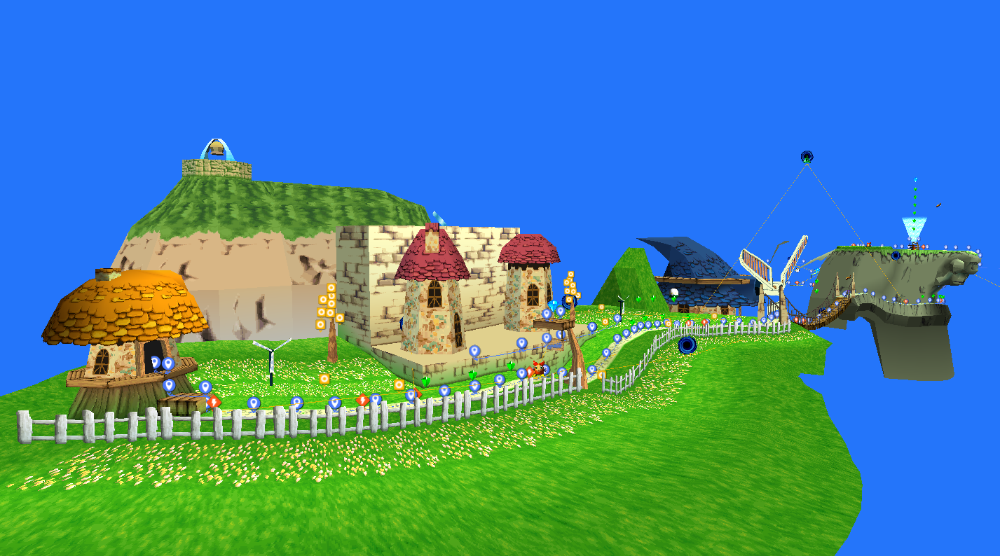

# BinarySerializer.Klonoa
BinarySerializer.Klonoa is an extension library to [BinarySerializer](https://github.com/RayCarrot/BinarySerializer) for serializing the game data in the Klonoa games. This can be used for reverse engineering and to read/write to any of its files, export the data (such as the graphics, models, sounds etc.) and more.

To view the parsed data directly from the files the [Binary Data Explorer](https://github.com/RayCarrot/BinaryDataExplorer) tool can be used.


Example image is from this library being used in [Ray1Map](https://github.com/Adsolution/Ray1Map) to display the maps.

# Supported Games and Versions
## Currently Supported Versions
* Klonoa: Door to Phantomile (Prototype 1997/07/17, NTSC)
* Klonoa 2: Lunatea's Veil (NTSC, PAL - _currently limited support only_)
* Klonoa Heroes (JP)

## Planned Versions
* Klonoa: Door to Phantomile (Prototype 1997/12/18, NTSC-J, PAL, Demo)
* Klonoa: Beach Volleyball
* Klonoa (Wii)

_Note:_ The first two GBA games are currently only supported directly in [Ray1Map](https://github.com/Adsolution/Ray1Map/tree/master/Assets/Scripts/Games/GBAKlonoa/Serializable). They might be migrated to this library in the future.

# Get Started
To use this library in your own project you must first reference [BinarySerializer](https://github.com/BinarySerializer/BinarySerializer), [BinarySerializer.PlayStation](https://github.com/BinarySerializer/BinarySerializer.PlayStation) and [BinarySerializer.Nintendo](https://github.com/BinarySerializer/BinarySerializer.Nintendo) as it relies on these libraries. After that you can quickly get started using the `Loader` class.

## Door to Phantomile

```cs
// First create a context for the data serialization
using Context context = new Context(basePath);

// Create the game settings
KlonoaSettings_DTP_US settings = new KlonoaSettings_DTP_US();

// Add the game settings to the context
context.AddKlonoaSettings(settings);

// Add the IDX and BIN to the context. The BIN gets added as a linear file while the IDX has to be memory mapped. If the level data will be parsed then the exe needs to be added too.
context.AddFile(new LinearFile(context, settings.FilePath_BIN));
context.AddFile(new MemoryMappedFile(context, settings.FilePath_IDX, settings.Address_IDX));

// Load the IDX
IDX idx = FileFactory.Read<IDX>(settings.FilePath_IDX, context);

// Create the loader, passing in the context and IDX
Loader_DTP loader = Loader_DTP.Create(context, idx);

// Switch to the BIN block you want to load. Block 3 is Vision 1-1 for example, while block 0 is the fixed block.
loader.SwitchBlocks(3);

// Load and process the BIN block
loader.LoadAndProcessBINBlock();

// The data is now stored in the loader and can be accessed
LevelPack_ArchiveFile level = loader.LevelPack;
Sprites_ArchiveFile[] spriteSets = loader.SpriteSets;

// For example the level model can be accessed in the level pack
PS1_TMD levelModel = level.Sectors[0].LevelModel;

// The textures and palettes are stored in the virtual VRAM in the loader
PS1_VRAM vram = loader.VRAM;
```

## Lunatea's Veil
```cs
// First create a context for the data serialization
using Context context = new Context(basePath);

// Create a configuration
KlonoaSettings_LV_US settings = new KlonoaSettings_LV_US();

// Add the game settings to the context
context.AddKlonoaSettings(settings);

// Add the header pack file to the context
context.AddFile(new LinearFile(context, settings.FilePath_HEAD));

// Add the BIN files to the context
for (int i = 0; i < 3; i++)
{
    var bin = (Loader_LV.BINType)i;

    // The KL file can have multiple language BINs depending on the version
    if (bin == Loader_LV.BINType.KL)
    {
        for (int lang = 0; lang < settings.LanguagesCount; lang++)
            context.AddFile(new LinearFile(context, settings.GetFilePath(bin, languageIndex: lang)));
    }
    else
    {
        context.AddFile(new LinearFile(context, settings.GetFilePath(bin)));
    }
}

// Load the header pack
HeadPack_ArchiveFile headPack = FileFactory.Read<HeadPack_ArchiveFile>(settings.FilePath_HEAD, context, (_, head) => head.Pre_HasMultipleLanguages = settings.HasMultipleLanguages);

// Create the loader, passing in the context, header pack and configuration
Loader_LV loader = Loader_LV.Create(context, headPack);

// Load data from the BIN files
// Each vision has a preload archive and a data archive

// Even-numbered archives are preload archives
LevelPreloadPack_ArchiveFile preloadPack = loader.LoadBINFile<LevelPreloadPack_ArchiveFile>(Loader_LV.BINType.KL, 2);

// Odd-numbered archives are data archives
LevelDataPack_ArchiveFile dataPack = loader.LoadBINFile<LevelDataPack_ArchiveFile>(Loader_LV.BINType.KL, 3);

// The last archive in KLDATA.BIN (199) is for menu sprites
MenuSpritesPack_ArchiveFile menuSprites = loader.LoadBINFile<MenuSpritesPack_ArchiveFile>(Loader_LV.BINType.KL, 199);
```

## Klonoa Heroes
```cs
// First create a context for the data serialization
using Context context = new Context(basePath);

// Create the game settings
KlonoaSettings_KH settings = new KlonoaSettings_KH();

// Add the game settings to the context
context.AddKlonoaSettings(settings);

// Add the pointers to the context
Context.AddPreDefinedPointers(DefinedPointers.GBA_JP);

// Add the ROM file to the context
context.AddFile(new MemoryMappedFile(context, romFileName, GBAConstants.Address_ROM));

// Load the ROM
KlonoaHeroesROM rom = FileFactory.Read<KlonoaHeroesROM>(romFileName, context);
```

# Documentation

**Common**

* [File (format)](docs/Format_FILE.md)
* [Compression](docs/Compression.md)

**Door to Phantomile**

* [IDX (format)](docs/DTP/Format_IDX.md)
* [BIN (format)](docs/DTP/Format_BIN.md)
* [Level](docs/DTP/Level.md)
* [Object](docs/DTP/Object.md)

**Lunatea's Veil**

N/A
